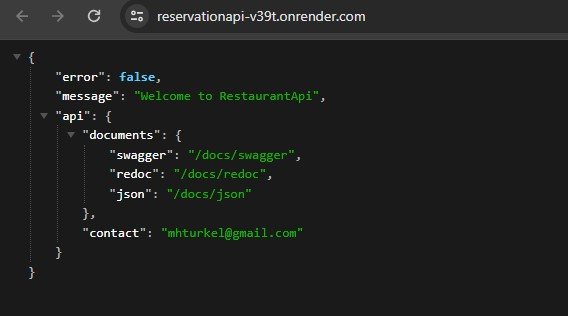

# backend-restaurantapi

Restaurant-app is a project that you can see restaurants and you can create reservation by choosing date and time. Then you can see your reservations and update and cancel. And this repo is the backend side of the project. To see the frontend repo you can visit [frontend-restaurantapp.](https://github.com/Hasan-Turkel/frontend-restaurantapp)  

## [Click to see live link](https://reservationapi-v39t.onrender.com)

## This is how the site looks like.

